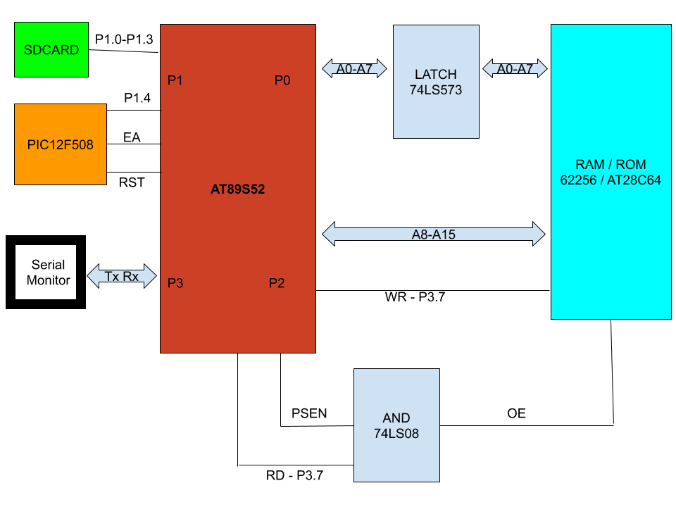

## 8051 FAT16 LOADER

---

### Implementations 

- UART implementation using UART hardware of 8052
- Serial Peripheral Interface (SPI) implementation using software Bit-Banging
- SD Card Interface via software SPI
- FAT16 Driver on top of SD Card Interface via SPI -> Support only for MBR-DOS Partition Tables and only files in root directory of a FAT16 partition are accessible. Sub directories are not supported.  
- Interfacing 8052 to an external memory - RAM (62256) and ROM (AT28C64) - both have been tested and are interchangeable - take care of EEPROM write protection
- SERIAL LOADER - load an executable (BINARY) to the external RAM/ROM over UART
- FAT16 LOADER - load an executable (BINARY) file stored in the root of FAT16 Partition to the external RAM/ROM.
- Run the executable (BINARY) loaded by SERIAL or FAT16 LOADER from the external RAM/ROM.

---

### Parts Used

- AT89S52 - 8K Internal ROM - 256 Internal RAM
- 74573 -> 8 Bit D-Latch
- 7408  -> AND Gate
- PIC12F508 -> Used to control EA and RST of AT89S52 to execute code from Internal ROM or eternal ROM/RAM
- SD Card
- USB to UART Serial Adapter to view the terminal 
- Python - for loading binary file over UART Serial while using Serial Loader.

---

### Circuit Bus Diagram

---

### ASCIINEMA
[ASCIINEMA](https://asciinema.org/a/mjE9zp2sO7yfRFMzK2HzkH6XJ)

  <link rel="stylesheet" type="text/css" href="/asciinema-player.css" />
  <asciinema-player src="/258140.cast" cols="136" rows="35"></asciinema-player>
  ...
  
